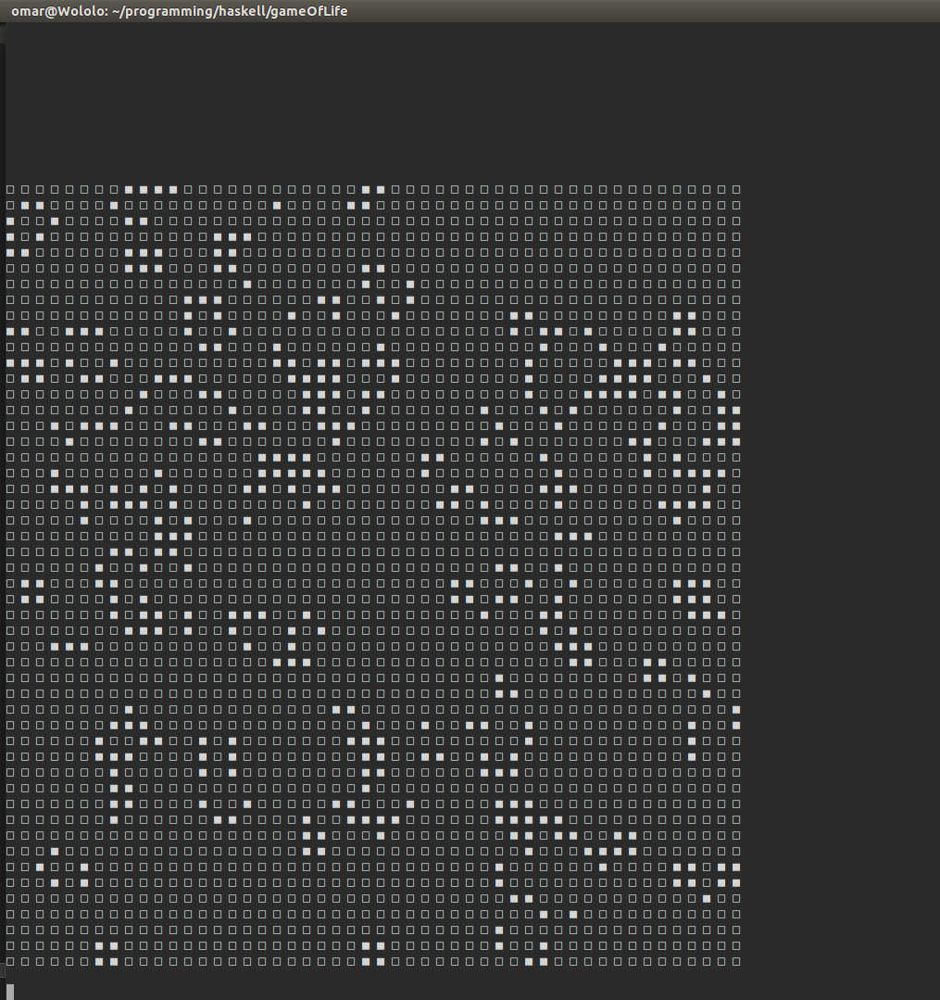
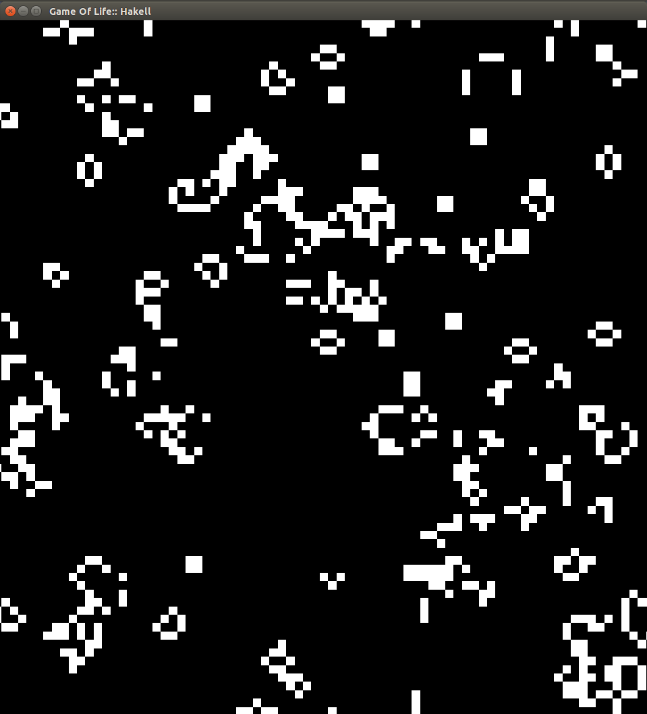

Simple Conway's game of life implementation in Haskell.
By:

The main idea is now implemented. There are 2 main executable files.
Main.hs runs a text based version through a terminal, I believe it will compile
with only the libraries in the Haskell Platform.

AnimatedMain is a graphical (Much Cooler) Implementation using OpenGl and GLFW-b
for rendering.

Still Much of the code to be Cleaned up and probably better ways to write. But I'm
pretty happy with the Results at this point.

