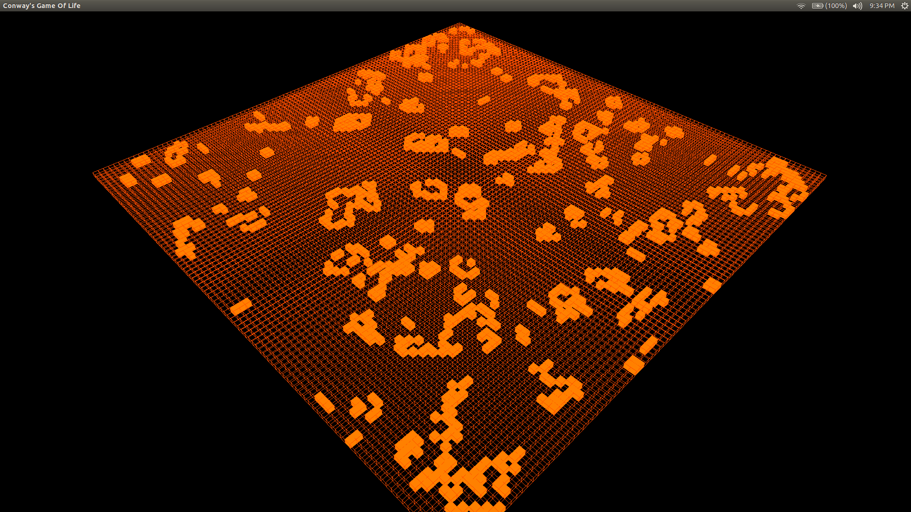

Conway's game of life implementation in Haskell.
By: Chava Rea

Conway's Game Of Life, cellular autamaton implemented in haskell using Repa mutable arrays
to represent data. OpenGL and Glut binding for graphics implementations.

Arrow Keys, mouse, space bar and shift work to move about the world. Note mouse camera
rotation still needs some work.

Compile with ghc -iGraphics/ Main.hs

Much optimization to be done!

